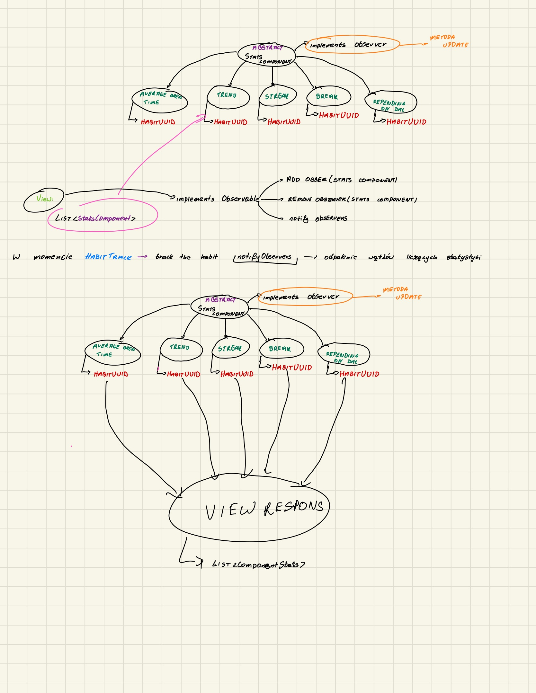

## Iteration2 habit and goal statistics breakdown.
***
### 1. Habit statistics:
* `Trend indicator` - value which indicates habit realization tendency by display proper value depends on habit history.
* `Streak` - number of periods in row with successfully done habit. This stat covers biggest number so far and actual.
* `Depending on day` - percent of successfully done habit in daily time frame.
* `Average break duration` - number of days of break within habit realization time period.
* `Daily completion count` - number of successfully done habits per day.
***
### 2. Goal Statistics:
* `Partial completion percent` - percent of completion of habit associated with goal.
* `Goal Completion percent` - percent of whole goal completion.
***
### 3. View:
Mock architecture is located in observerTesting project directory. 

#### 3.1 Architecture description:
Architecture is based on observer design pattern. The is view observable and Stats Components are observer.Whenever user tracks the habit it calls view 
notifying process which creates separate thread to call update method on all descendants of StatsComponent. Update method generate  ComponentResponseContainer  which is parent class of all those reponses written in 5. Description part
All those containers can be shipped straight into the fronted off the app through the some kind of page object.

### 4. Justification:
Iteration2 is the extension to already implemented entries like habit track and goal completion.  `Streak` and `Daily completion count` enhances user to continue to perform based on motivation factor in the other hand the rest of stats indicators giving the user information how he is performing
in specified time interval which can be crucial in adjust optimal strategy for habit completion and achieving goals. 

#### 4.1 Architecture justification:
The main reason to implement that kind of architecture is to make view as responsive as possible and lower the amount of db calls. This approach fetches really specified amount of data(only component added to view) on demand with saving anything to database. In theory the whole time of the operation is time need for the longest StatsComponent update operation.
*** 
### 5. Description:
`Trend Indicator`:  
**Input**: list of habit tracks.   
**Output**: TrendIndicator ENUM ex. RISING, FALLING, POSITIVE STAGNATION, NEGATIVE STAGNATION.

`Streak`: 
**Input**: list of habit tracks.  
**Output**: StreakResponse object  ex. StreakResponse: { longest: 10, actual: 2 }.

`Depending on day`:  
**Input**: list of habit tracks.  
**Output**: DependingOnDayResponse ex.  DependingOnDayResponse: { monday: 10.0, tuesday: 29.9, wednesday: 0.9, thursday: 39.2, friday: 100.0, Saturday: 0.0, Sunday: 0.0}.

`Average break duration`:  
**Input**: list of habit tracks.  
**Output**: Double value ex. 5.91.

`Daily completion count`:  
**Input**: list of habit tracks.  
**Output**: DayCompletionCountResponse.

* `Partial completion percent`:  
**Input**: int of habit actual count.
**Output**: double of percent of completion. 
* `Goal Completion percent` - :  
**Input**: int of sum of every actual completion count and completion count.
**Output**: double of percent of completion for whole goal.

