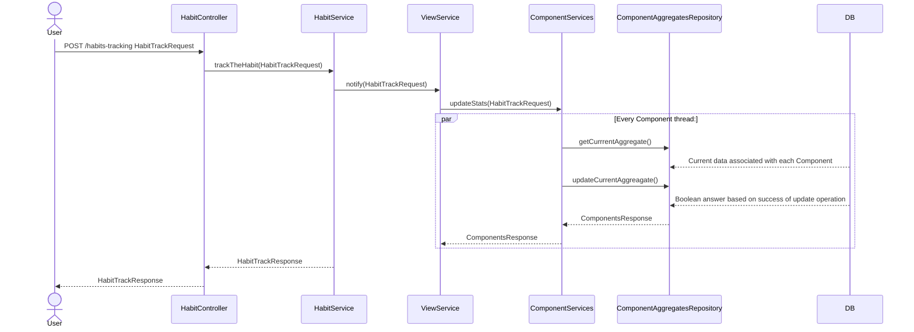
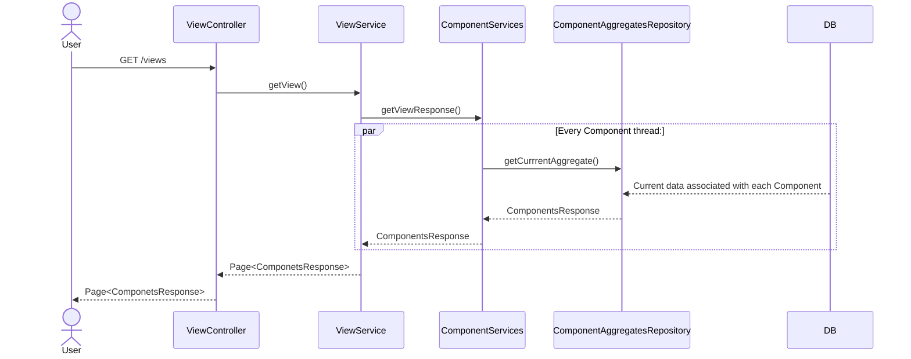
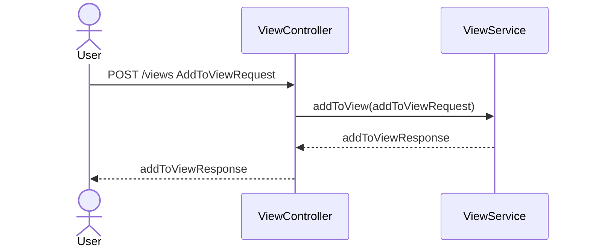

## Iteration2 habit and goal statistics breakdown.

### 1. Habit statistics - StatsComponents:
* `Trend indicator` - value which indicates habit realization tendency by display proper value depends on habit history.
* `Streak` - number of periods in row with successfully done habit. This stat covers biggest number so far and actual.
* `Depending on day` - percent of successfully done habit in daily time frame.
* `Average break duration` - number of days of break within habit realization time period.
* `Daily completion count` - number of successfully done habits per day.
***
### 2. Goal Statistics:
* `Partial completion percent` - percent of completion of habit associated with goal.
* `Goal Completion percent` - percent of whole goal completion.
***
### 3. View:
Mock architecture is located in observerTesting project directory. 
#### 3.1 Architecture description:
Architecture is based on observer design pattern. The is ViewService observable and ComponentServices are observers.Whenever user tracks the habit it calls view 
notifying process which creates separate thread to call update method on all descendants of ComponentServices. 

