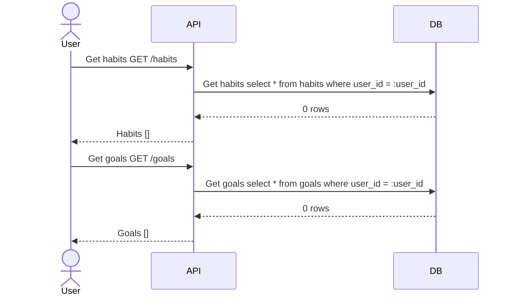
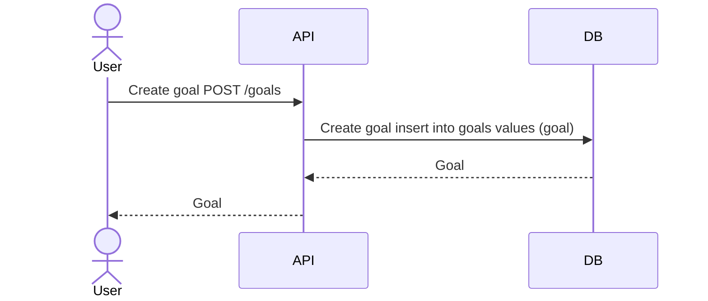
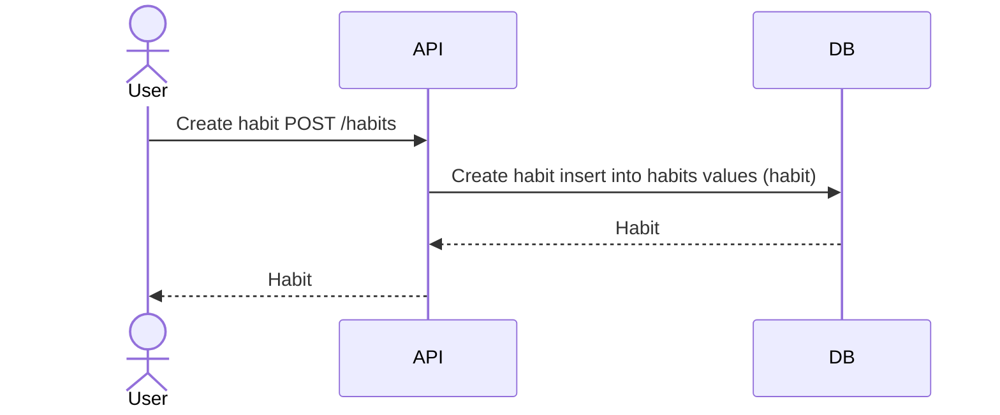
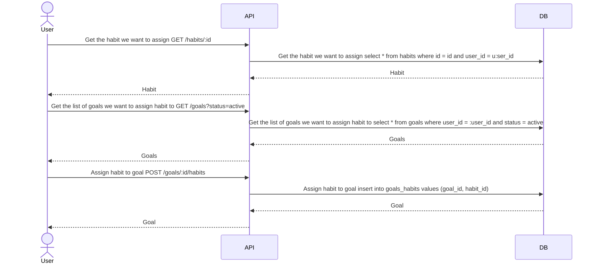
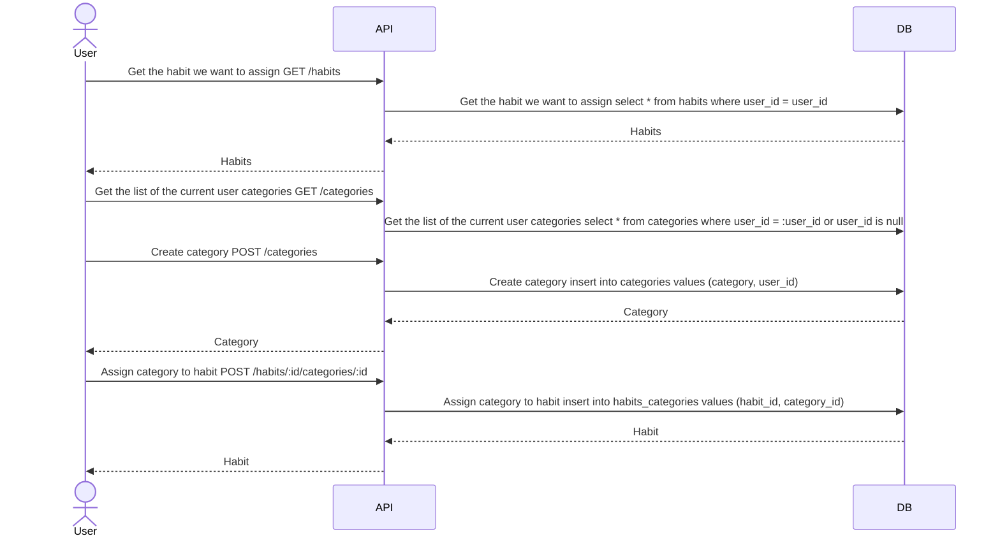
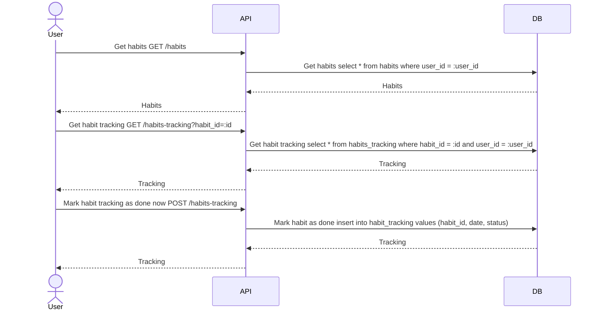

# Dream tracker

## Functional Requirements:

___
### Security oriented
* User is able to safely register an account
  * Using google account - oauth 
  * Using facebook account
  * Using github account  
  * Using email of choice
    * In this case email needs to be confirmed via verification mail

* User is able to safely authenticate
  * Using google account
  * Using github account 
  * Using previously registered account if correct credentials were provided

* User is able to change his credentials if the registration with email of choice were selected
* User is able to change his password in case of forgetting if registration with email of choice were selected via email with link to change password form
___
### Habit oriented
* User is able to create Habit to track
    * User is able to define action - habit itself 
    * User is able to define frequency of habit(Daily/Weekly/Monthly)
    * User is able to define duration of a habit
    * User is able to attach category to a habit(in predefined set of categories or created one)
    * User is able to attach habit to a certain goal
    * User is able to define difficulty of habit(Easy/Medium/Hard)
    * User is able to add other people to habit or goal via email or username
    * User is able to define status of a habit(Active/Inactive)
* User is able to create goal
  * User is able to define list of habits which goal consist of 
  * User is able to define amount of done habits to finish a goal
  * User is able to define duration of the goal
* User is able to see his progress through charts 
  * User is able to switch views of charts
    * Connected with certain goal 
    * Connected with certain category
    * Connected with certain habit
    * Connected with habit of choice 
* User is able to apply predefined habit creation schema for habit of choice
* User is able to attach habit to own profile page
* User is able to mark habit as done or undone for specified time interval 
  * Properly marked habit is being count to goal if attached and it counts to habit statistics chart
* User is able to browse through active and inactive habits 
___
### Interface oriented 
* User is able to create his own view of of Habit tracking(by moving habit blocks)
* User is able to use predefined set of views
  * Habit oriented
  * Goal oriented
  * Category oriented
___

### Sequence diagrams

### New user without habits and goals

### User sets up a goal

### User sets up a habit

### User optionally assigns a habit to a goal

### User assigns a custom category to the habit

### User fetches habits, check the tracking of one of them and marks it as done
