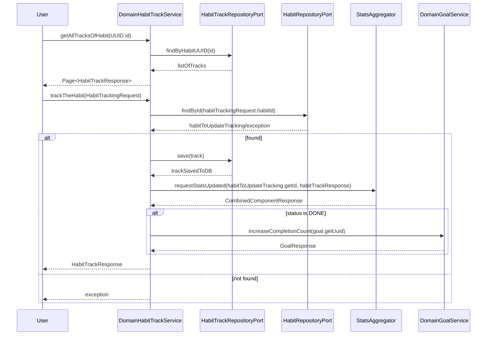

# Dream tracker - General docs

The Dream Tracker application was created to develop habits, monitor progress in completing them, and achieve set goals. Its main purpose is to track progress based on statistics calculated by the application, presented in an accessible way. This project was designed for users who want to work on themselves systematically and introduce changes into their daily lives.

## Functional Requirements:

### Security oriented
* User is able to safely register an account
    * Using email of choice
        * In this case email needs to be confirmed via verification mail
* User is able to safely authenticate
    * Using previously registered account if correct credentials were provided
* User is able to change his password in case of forgetting if registration with email of choice were selected via email with link to change password form
___
### Habit oriented
* User is able to create Habit to track
* User is able to define action - habit itself
* User is able to define frequency of habit(Daily/Weekly/Monthly)
* User is able to define duration of a habit
* User is able to attach habit to a certain goal
* User is able to define difficulty of habit(Easy/Medium/Hard)
* User is able to mark habit as completed
* User is able to update habit details
* User is able to delete habit
* User is able to mark habit as done or undone for specified time interval
    * Properly marked habit is being count to goal if attached and it counts to habit statistics chart
### Goal oriented
* User is able to create goal
    * User is able to define habit which goal consist of
    * User is able to define amount of done habits to finish a goal
    * User is able to define duration of the goal
    * User is able to delete goal
### Charts oriented
* User is able to see individual habit progress through charts
   * User is able to see average break between each habit completion
   * User is able to success rate of habit tracking for each day of the week
   * User is able to see number of done and undone habits and calculated trend based on that
   * User is able to see the longest consecutive habit tracking streak
* User is able to see  number of done habits per day in monthly time frame
___
### View oriented
* User is able to create his own view of of Habit tracking(by moving blocks)
* User is able to save block position
* User is able to reset block position
* User is able to turn off/turn on moving blocks visibility 

___

  

